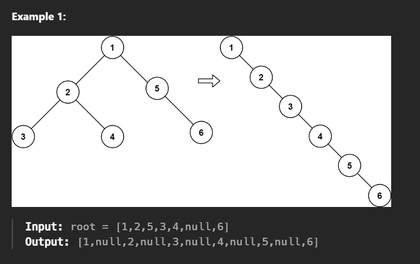

# Flatten Binary Tree to Linked List

- Given the root of a binary tree, flatten the tree into a "linked list":

- The "linked list" should use the same TreeNode class where the right child pointer points to the next node in the list and the left child pointer is always null.
- The "linked list" should be in the same order as a pre-order traversal of the binary tree.

## Constraints:

- The number of nodes in the tree is in the range [0, 2000].
- -100 <= Node.val <= 100
 