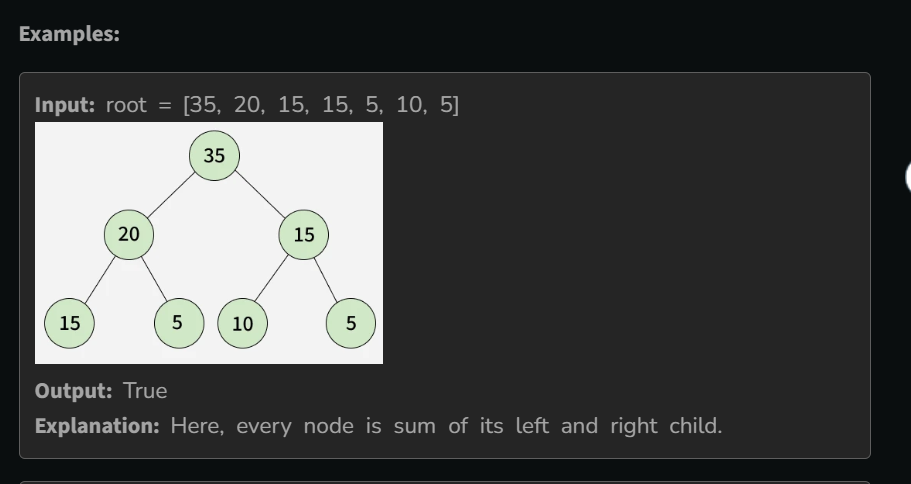

# Children Sum in a Binary Tree

- Given the root of a binary tree, determine whether the tree satisfies the Children Sum Property. 
- In this property, each non-leaf node must have a value equal to the sum of its left and right children's values. 
- A NULL child is considered to have a value of 0, and all leaf nodes are considered valid by default.
- Return true if every node in the tree satisfies this condition, otherwise return false

## Example

