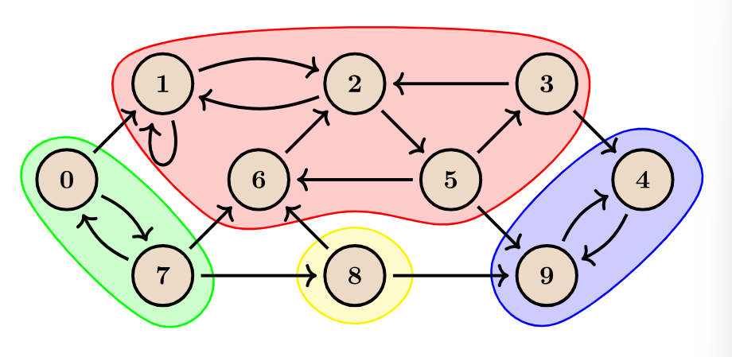
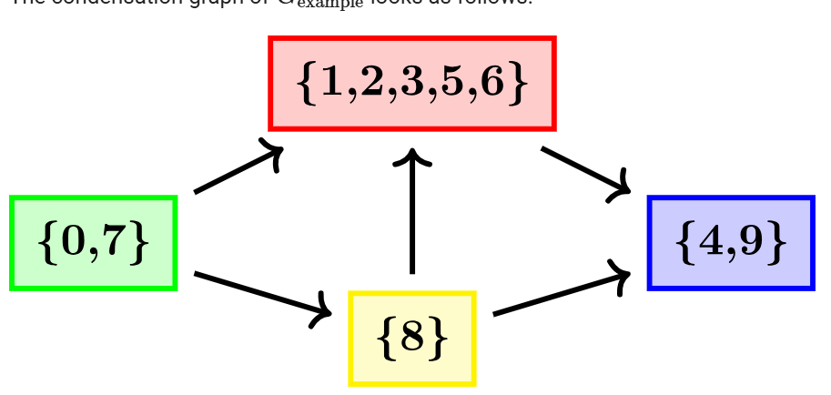

# Strongly Connected Components

- Let G = (V,E) where V is the vertices and E is Edges. G is a directed Graph where edges E is a complete subset of VxV.

- A subset of vertices C subset of V is called strongly connected component if the following condition hold true.

1. For all u,v subset of C, u != v, there is an edge from u->v and v->u.
2. C is maximal, in sense that no vertex can be added without voilating the first condition.

- SCC(G) is a set of strongly connected components of graph. These components do not intersect with each other.

- SCC(G) = {{0,7},{1,2,3,5,6},{4,9},{8}}

# Condensation Graph

- G^SCC = (V^SCC, E^SCC)
1. The vertices of G^SCC are the strongly connected components of a graph G; i.e V^SCC = SCC(G).
2. For all vertices Ci, Cj of the condensation graph, there is an edge from Ci to Cj iff Ci != Cj and there exist a belong to Ci and b belong to Cj such that there is an edge from a->b.

- Condensation Graphs are acyclic

# Kosaraju's Algorithm

- Runtime O(n+m) or O(V+E).

- The algorithm proceeds in two pass.

- In the first pass, we do a dfs search on the entire graph and mark all the nodes as visited. While doing this we keep track of the T-out i.e the out time of each node. Out time is when for a vertex V all the nodes reachable from V are visited or we can say that when the dfs call on vertex V is finished.

- Upon observing carefully that the vertex on which the dfs call is made first will be having the largest out time. Hence we can say that nodes will be stores in a reverse topological sort.

- Exit time/out time for a strongly connected component is defined as the maximum of all the exit times for all vertex in the component.

- Similary we can define an entry time Tin for vertex as the time at which the dfs call on the vertex V is made.

- The entry time for a strongly connected component is the minimum of all the entry time for all the nodes in the component.

### Theorem 1

- The C and C' be two different SCC, and let there be a single edge from C->C' in the condensation graph. Then Tout[C] > Tout[C'].

- If we sort the vertices in an decreasing order of there exit time, the first vertex will belong to the "root" SCC i.e the SCC that has no incoming edges.

- We need a way to perform a dfs traversal in one component at a time and no other vertex.

- To find such a way, we need to consider another theorem

### Theorem 2

- The Gt is the transpose graph of G achieved by reversing the edge direction of every pair of vertex. Then SCC(Gt) == SCC(G). Condenstation graph of Gt is the transpose of condensation graph of G.

Example: C1->C2->C3 where C1, C2, C3 are condensation graphs of G, after the transpose we will have 
C1'<-C2'<-C3'. As a consequence there will be no outgoing edges from the "root" SCC. And hence, we can perform a dfs traversal and visite just the component. We can then remove these vertices from the graph and choose the next largest Tout[v] and run a dfs starting from that vertex on the transpose graph.

### Observation

- In the first pass of dfs we find the vertices in increasing order of their exit time. If the graph is Acyclic, this corresponds to (reversed) topological order.

- In the second pass, we find the strongly connected component in decreasing order of their exit time. Thus the algorithm find components-vertices of the condensation graph - in an order corresponding to a topological sort of condensation graph.
