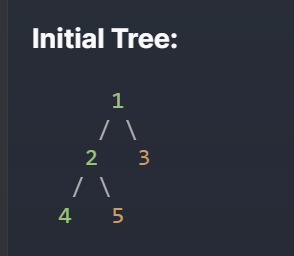
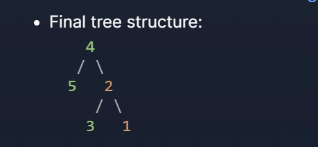

# Problem Statement

- You are given a binary tree and need to transform it by flipping it upside down according to specific rules.

### The transformation works as follows:

1. The leftmost node (original left child) becomes the new root of the tree
2. The original root node becomes the right child of what was previously its left child
3. The original right child becomes the left child of what was previously the root's left child

### The problem guarantees that:

1. Every right node has a sibling (a left node that shares the same parent)
2. No right node has any children of its own

- The task is to implement a function that takes the root of the original binary tree and returns the root of the new upside-down tree. If the tree is empty or has no left child, it remains unchanged.

### Before

### After

